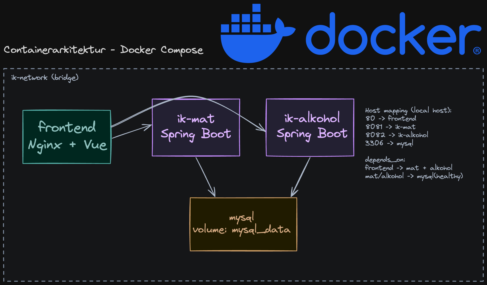
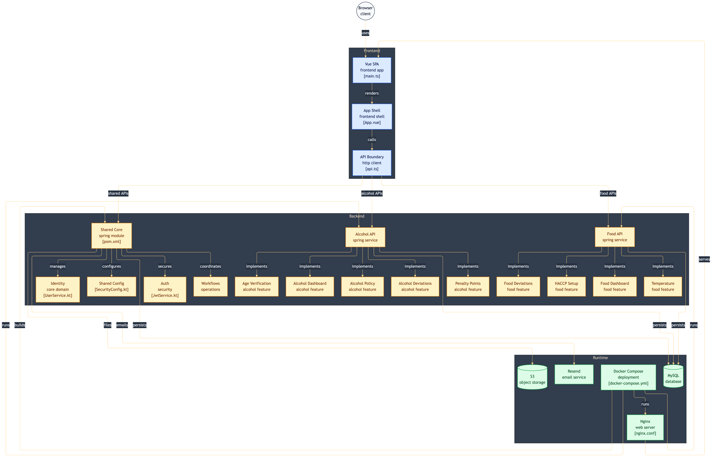
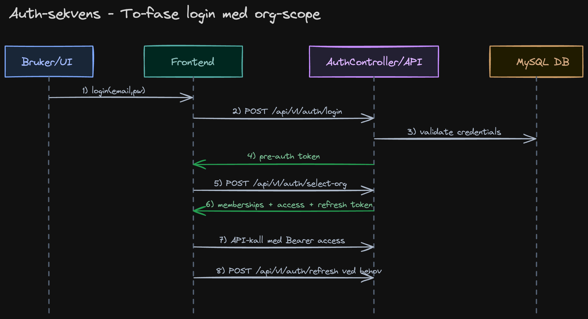
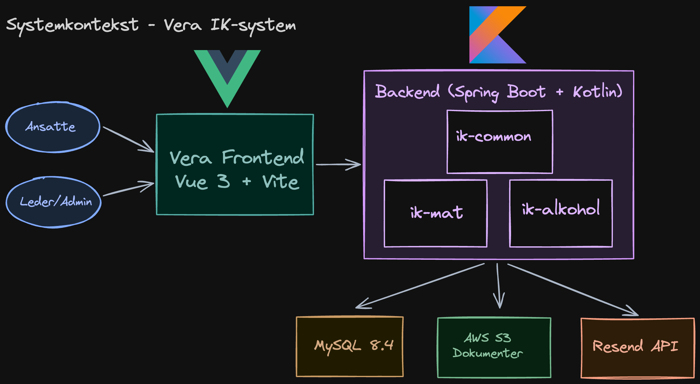
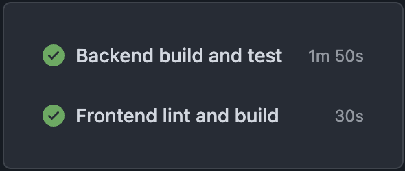

# Dokumentasjon

|    |    |
|------|-------|

> [!IMPORTANT]
> **Målet med dette dokumentet** er å gjøre det enkelt for sensorer, medstudenter og nye utviklere å forstå systemet, kjøre det lokalt, teste det og videreutvikle det.
>
> **Sist oppdatert:** 2026-04-09

---

## Innhold

- [Dokumentasjon](#dokumentasjon)
  - [Innhold](#innhold)
  - [1. Kort om prosjektet](#1-kort-om-prosjektet)
  - [2. Hva som kreves levert (krav → hvor det finnes)](#2-hva-som-kreves-levert-krav--hvor-det-finnes)
  - [3. Systemoversikt og arkitektur](#3-systemoversikt-og-arkitektur)
    - [3.1 Moduler og ansvar](#31-moduler-og-ansvar)
    - [3.2 Arkitekturdiagrammer](#32-arkitekturdiagrammer)
    - [3.3 Request-flyt (viktig for forståelse)](#33-request-flyt-viktig-for-forståelse)
  - [4. Kjøring lokalt med docker (Anbefalt)](#4-kjøring-lokalt-med-docker-anbefalt)
    - [4.1 Forutsetninger](#41-forutsetninger)
    - [4.2 Start alt](#42-start-alt)
    - [4.3 Stoppe / reset](#43-stoppe--reset)
  - [5. Kjøring lokalt uten Docker (utvikling)](#5-kjøring-lokalt-uten-docker-utvikling)
    - [5.1 Backend](#51-backend)
    - [5.2 Frontend](#52-frontend)
  - [6. API-dokumentasjon (Swagger/OpenAPI)](#6-api-dokumentasjon-swaggeropenapi)
    - [6.1 Swagger UI (samlet)](#61-swagger-ui-samlet)
    - [6.2 Direkte OpenAPI JSON](#62-direkte-openapi-json)
    - [6.3 Forklaring av endepunkter](#63-forklaring-av-endepunkter)
  - [7. Autentisering og autorisasjon](#7-autentisering-og-autorisasjon)
    - [7.1 Mekanisme](#71-mekanisme)
    - [7.2 Viktige endepunkter](#72-viktige-endepunkter)
    - [7.3 Roller](#73-roller)
      - [7.3.1 Rolle-matrise (implementert tilgang)](#731-rolle-matrise-implementert-tilgang)
  - [8. Database, migreringer og testdata](#8-database-migreringer-og-testdata)
    - [8.1 Database (Docker)](#81-database-docker)
    - [8.2 Flyway migreringer](#82-flyway-migreringer)
    - [8.3 Testbrukere](#83-testbrukere)
    - [8.4 Eksterne integrasjoner (S3/Resend)](#84-eksterne-integrasjoner-s3resend)
  - [9. Testing og code coverage](#9-testing-og-code-coverage)
    - [9.1 Backend (JUnit/Kotest + JaCoCo)](#91-backend-junitkotest--jacoco)
    - [9.2 Frontend (Vitest)](#92-frontend-vitest)
  - [10. CI/CD](#10-cicd)
  - [11. OWASP og universell utforming](#11-owasp-og-universell-utforming)
    - [11.1 OWASP (hva som er implementert)](#111-owasp-hva-som-er-implementert)
    - [11.2 Universell utforming (tilgjengelighet)](#112-universell-utforming-tilgjengelighet)
  - [12. Vedlikehold og videreutvikling](#12-vedlikehold-og-videreutvikling)
    - [12.1 Vanlige utviklingsoppgaver](#121-vanlige-utviklingsoppgaver)

---

## 1. Kort om prosjektet

**IK System** er et digitalt internkontrollsystem for serveringsbransjen.
Systemet er delt i to toppnivå-tjenester:

- **IK-Mat**: temperatur, HACCP-oppsett, matrelaterte avvik, dashboard
- **IK-Alkohol**: aldersverifisering, alkoholpolicy, alkoholrelaterte avvik, prikkbelastning, dashboard

Begge deler **gjenbruker felles funksjonalitet** fra `ik-common` (f.eks. auth, organisasjoner/tenant, brukere, dokumenter, sjekklister, rapporter, varsler).

> [!NOTE]
> Oppgaveteksten krever at systemet støtter flere tenants. I dette prosjektet er det modellert som **organisasjoner** med **medlemskap/roller**.

---

## 2. Hva som kreves levert (krav → hvor det finnes)

Tabellen under speiler dokumentasjonskravene fra oppgaveteksten (pkt. 5–6) og viser hvor vi dekker det.

| Krav fra oppgave | Hvordan vi oppfyller | Hvor i repo | Status |
|---|---|---|---|
| API-endepunkt dokumentasjon (Swagger + forklaring) | OpenAPI JSON + samlet Swagger UI-side | `frontend/swagger.html` + OpenAPI på backend | ikke ferdig |
| Kode dokumentert (javadoc/kdoc) | KDoc/Javadoc på sentrale klasser og konfig | `backend/**/src/main/**` | ikke ferdig |
| Systemdokumentasjon (ny utvikler kan komme i gang) | Kjøring, arkitektur, moduler, dataflyt, testing | **Dette dokumentet** | ok |
| Testdata (testbrukere, DB creds) | Seed-data via Flyway + tabell her | `backend/ik-common/src/main/resources/db/migration/` | ok |
| Avhengigheter/prereqs dokumentert | Docker, Java/Node, secrets, S3/Resend | Seksjon 4–5 + `.env.example` | ok |
| Kjøring av system og tester “enkelt” | `docker compose up --build`, `./mvnw …`, `npm run …` | Rot-README + denne | ok |
| DB scripts (Flyway) + testdata | Flyway migreringer med seed | `backend/ik-common/src/main/resources/db/migration/` | ok |
| CI/CD brukt underveis | GitHub Actions workflow | `.github/workflows/ci.yml` | ok |
| OWASP + universell utforming | Sikkerhetstiltak + TODO-liste | Seksjon 11 | ikke ferdig |

---

## 3. Systemoversikt og arkitektur

### 3.1 Moduler og ansvar

| Del | Mappe | Ansvar |
|---|---|---|
| Frontend (SPA) | `frontend/` | Vue 3-app, routing, UI, API-kall |
| Backend: felles | `backend/ik-common/` | Auth/JWT, organisasjoner, brukere, sjekklister, dokumenter, varsler, rapporter, DB migreringer |
| Backend: IK-Mat | `backend/ik-food-service/` | Temperatur + HACCP + matavvik + mat-dashboard |
| Backend: IK-Alkohol | `backend/ik-alcohol-service/` | Aldersverifisering + alkoholpolicy + alkoholavvik + prikkbelastning + alkohol-dashboard |
| Dokumentasjon | `docs/` | Systemdokumentasjon, diagrammer, bilder |

### 3.2 Arkitekturdiagrammer

**Container-arkitektur arkitektur:**




**Klassediagram:**




**Sekvensdiagram: innlogging + organisasjonsvalg:**




**System-kontekst:**




### 3.3 Request-flyt (viktig for forståelse)

Frontend kjører bak Nginx og **proxyer API-kall** til riktig backend-tjeneste.

- Standard `/api/v1/**` går til **IK-Mat**
- Noen path-er rutes eksplisitt til **IK-Alkohol** (f.eks. alkoholavvik, age verification)

> [!NOTE]
> Denne rutingen er definert i `frontend/nginx.conf`.

---

## 4. Kjøring lokalt med docker (Anbefalt)

### 4.1 Forutsetninger

- Docker Desktop (inkludert Docker Compose)
- Git

### 4.2 Start alt

Fra repo-roten:

```bash
docker compose up --build
```

Tjenester som starter:

| Tjeneste | URL lokalt | Notat |
|---|---:|---|
| Frontend (Nginx + SPA) | http://localhost | Proxyer `/api/*` videre |
| IK-Mat API | http://localhost:8081 | Kjøres internt på 8080 i container |
| IK-Alkohol API | http://localhost:8082 | Kjøres internt på 8080 i container |
| MySQL | `localhost:3306` | DB: `ik_system` |

### 4.3 Stoppe / reset

```bash
docker compose down
```

Fjern også DB-data:

```bash
docker compose down -v
```

---

## 5. Kjøring lokalt uten Docker (utvikling)

### 5.1 Backend

Vi har et samlet dev-script som starter **alt** du trenger i utvikling:

- MySQL (Docker Compose)
- IK-Mat (port `8081`)
- IK-Alkohol (port `8082`)
- Frontend (Vite, port `5173`)

Kjør fra repo-roten:

```bash
chmod +x dev-up.sh
./dev-up.sh
```

Logger skrives til `.run-logs/` (i repo-roten).

### 5.2 Frontend

Frontend startes automatisk av `./dev-up.sh`.

---

## 6. API-dokumentasjon (Swagger/OpenAPI)

### 6.1 Swagger UI (samlet)

Swagger UI serveres som en statisk side i frontend-containeren:

- http://localhost/swagger.html

Den peker til:

- `/api/mat/v3/api-docs` (IK-Mat)
- `/api/alkohol/v3/api-docs` (IK-Alkohol)

### 6.2 Direkte OpenAPI JSON

- Docker (begge tjenester):
  - IK-Mat: http://localhost:8081/v3/api-docs
  - IK-Alkohol: http://localhost:8082/v3/api-docs
- Uten Docker (én modul lokalt):
  - Aktiv modul: http://localhost:8080/v3/api-docs

> [!NOTE]
> `springdoc.swagger-ui.enabled` er satt til `false` i backend sin `application.yml`. Det betyr at backend ikke serverer egen Swagger UI som standard, men OpenAPI JSON er tilgjengelig.

### 6.3 Forklaring av endepunkter


> [!TIP]
> For full detaljert spesifikasjon (schemas + prøving) bruk http://localhost/swagger.html.

---

## 7. Autentisering og autorisasjon

### 7.1 Mekanisme

- **JWT Bearer token** brukes for API-kall
- Passord er **BCrypt-hashet**
- API er konfigurert som **stateless** (ingen server-side session for API)

### 7.2 Viktige endepunkter

**Offentlige auth-endepunkter** (krever ikke JWT):

- `POST /api/v1/auth/register` (oppretter identitet → `preAuthToken`)
- `POST /api/v1/auth/login` (fase 1 → `preAuthToken` + memberships)
- `POST /api/v1/auth/refresh` (ny `accessToken` via `refreshToken`)

**Endepunkter som krever JWT**:

- `POST /api/v1/auth/select-org` (fase 2, org-scope)
- `POST /api/v1/auth/switch-org` (bytter org-kontekst)
- `GET /api/v1/auth/memberships` (org-switcher)
- `POST /api/v1/auth/logout` (revoker tokens/sessions)

Eksempel på auth-header:

```http
Authorization: Bearer <ACCESS_TOKEN>
```

> [!TIP]
> Swagger UI (http://localhost/swagger.html) støtter “Authorize” med JWT.

### 7.3 Roller

Systemet bruker roller per organisasjon (membership):

- `ADMIN`
- `MANAGER`
- `EMPLOYEE`

#### 7.3.1 Rolle-matrise (implementert tilgang)

Tabellen under er basert på `@PreAuthorize` i controllerne.

| Funksjon/område | EMPLOYEE | MANAGER | ADMIN |
|---|:---:|:---:|:---:|
| Logge inn + velge org | x | x | x |
| Se sjekklister + stats | x | x | x |
| Opprette/endre/slette sjekklister | - | x | x |
| Se training logs | x | x | x |
| Opprette/endre/slette training logs | - | x | x |
| Rapport preview/generate/export | - | x | x |
| Slette rapport | - | - | x |
| Dokument: hent URL | x | x | x |
| Dokument: upload/slett | - | x | x |
| Invitasjoner: send invite | - | x | x |
| Bruker/medlemskap: liste + administrere medlemmer | - | x | x |
| Fjerne medlem fra org | - | - | x |

> [!NOTE]
> Noen endepunkter uten `@PreAuthorize` kan likevel være begrenset i service-laget. Tabellen over viser det som er eksplisitt definert i controller-nivå.

---

## 8. Database, migreringer og testdata

### 8.1 Database (Docker)

- **DB**: `ik_system`
- **User**: `ik_user`
- **Pass**: `ik_password`
- **Port**: `3306`

Se `docker-compose.yml` og `.env.example`.

### 8.2 Flyway migreringer

Migreringer og seed-data ligger i:

- `backend/ik-common/src/main/resources/db/migration/`

Kritisk seed-fil:

- `V25__full_seed_data.sql` (full reset + realistiske testdata)

### 8.3 Testbrukere

Alle testbrukere har passord: `password`

| E-post | Rolle(r) | Organisasjon(er) | Kommentar |
|---|---|---|---|
| `admin@iksystem.local` | ADMIN | Everest + Nordvik | Systemadmin |
| `manager@iksystem.local` | MANAGER | Everest | Manager |
| `employee@iksystem.local` | EMPLOYEE | Everest | Ansatt |
| `kokk@iksystem.local` | EMPLOYEE | Everest | Kokk |
| `bartender@iksystem.local` | EMPLOYEE | Everest + Nordvik | Jobber i begge |
| `daglig@iksystem.local` | MANAGER | Nordvik | Daglig leder |
| `servitor@iksystem.local` | EMPLOYEE | Everest + Nordvik | Jobber i begge |
| `renhold@iksystem.local` | EMPLOYEE | Everest | Renhold |

> [!NOTE]
> Seed-data kan endres over tid. Denne tabellen speiler `V25__full_seed_data.sql`.

### 8.4 Eksterne integrasjoner (S3/Resend)

Prosjektet støtter:

- **AWS S3** (dokumentlagring)
- **Resend** (epost)

Konfigureres via `.env` (start med å kopiere `.env.example`).

> [!TIP]
> For lokal utvikling kan `RESEND_DEV_MODE=true` brukes for å unngå ekte utsendelser (avhengig av implementasjon).

---

## 9. Testing og code coverage

### 9.1 Backend (JUnit/Kotest + JaCoCo)

Kjør alt:

```bash
cd backend
./mvnw -B -ntp clean verify
```

eller
 
```bash
cd backend
mvn clean test 
```
coverage kan man se når man klikker på target - sites, og åpner index.html i browser

Coverage rapporter (JaCoCo) genereres per modul under `target/site/jacoco/`.

> [!IMPORTANT]
> Oppgaveteksten krever **minst 50% code coverage**.
> 
> TODO: Legg inn faktisk coverage-tall per modul før innlevering (mat/alkohol/common).

### 9.2 Frontend (Vitest)

Kjør tester:

```bash
cd frontend
npm run test:run
```

Kjør coverage:

```bash
cd frontend
npm run test:coverage
```

> [!NOTE]
> Frontend CI kjører lint + build i GitHub Actions. Tester kan legges til som ekstra steg hvis ønskelig.

---

## 10. CI/CD

CI er definert i GitHub Actions:

- `.github/workflows/ci.yml`

Den kjører:

- Backend: `./mvnw clean verify`
- Frontend: `npm ci`, `npm run lint:ci`, `npm run build`



---

## 11. OWASP og universell utforming

### 11.1 OWASP (hva som er implementert)

- Passord lagres som BCrypt hash
- JWT bearer tokens for API-autentisering
- Stateless API + CSRF deaktivert (API-scenario)
- CORS konfigurert for lokale origin-er
- OpenAPI security scheme (`bearerAuth`) definert

I tillegg (repo-verifisert):

- **Method-level authorization** via `@PreAuthorize` på kritiske endepunkter (admin/manager)
- **Refresh tokens** brukes for å hente ny access token (`/api/v1/auth/refresh`)
- **S3 presigned URL** for dokumenttilgang (typisk gyldig i 1 time)
- **Opplasting begrenset i proxy**: Nginx `client_max_body_size 10M`

### 11.2 Universell utforming (tilgjengelighet)

Dette er basert på komponentene som håndterer innlogging/registrering/orgvalg.

- **Skjemavalidering + feilmeldinger**: Frontend bruker `@tanstack/vue-form` + `zod` og viser feltspesifikke feil under input.
- **Synlig fokus**: Inputs har `:focus-visible` styling (ring/border) i UI-komponentene.
- **Semantikk**: Formularer bruker `form` + `label` og `button`.


---

## 12. Vedlikehold og videreutvikling

### 12.1 Vanlige utviklingsoppgaver

Legge til en ny feature (høy-nivå oppskrift)

1. Avklar hvilken tjeneste som eier domenet (mat vs alkohol vs common)
2. Legg til/endre DB via ny Flyway-migrering i `ik-common`
3. Implementer service/repository/controller
4. Oppdater OpenAPI (annotations) og legg til tester
5. Oppdater frontend (types, composables, views)
6. Verifiser med `docker compose up --build`

---
